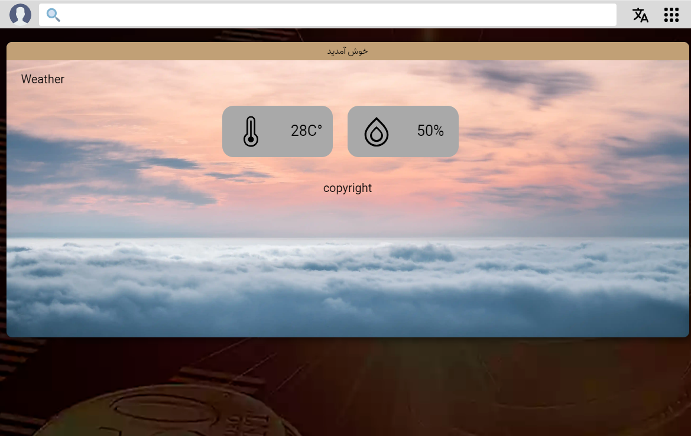

This is a uservice project from Turing Research Team.


This is a [Next.js](https://nextjs.org/) project bootstrapped with [`create-next-app`](https://github.com/vercel/next.js/tree/canary/packages/create-next-app).

## Getting Started

First, run the development server:

```bash
npm run dev -- -p 2000
# or
yarn dev -p 2000
```

Open [http://ituring.ir/userv](http://ituring.ir/userv) with your browser to see the result.

You can start editing the page by modifying components/Pages/index.tsx. The page auto-updates as you edit the file.

uweather 


